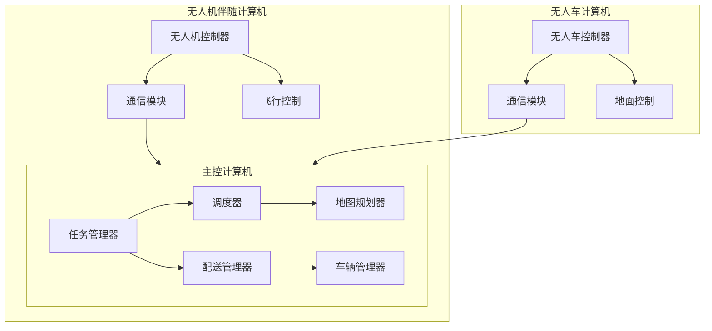
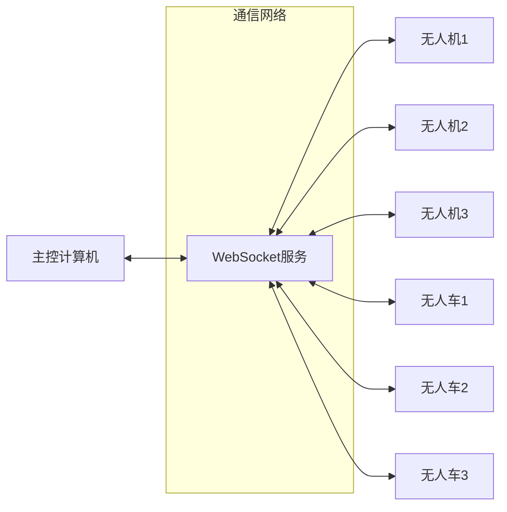

# TerraFly System - 无人机与无人车协同配送系统

## 项目简介
TerraFly System是一个创新的无人机与无人车协同配送系统，旨在提供高效、智能的物流配送解决方案。系统整合了无人机空中配送和无人车地面配送的优势，实现了全自动化的配送服务。

## 系统架构
系统分为三个主要部分：

### 系统架构图


### 系统拓扑图


## 硬件平台

### 1. 无人机平台
- **机架**：DJI F450 四轴机架
- **飞控**：Pixhawk Cube（搭载 PX4 固件）
- **伴飞电脑**：Raspberry Pi 4B + MAVLink 连接
- **动力系统**：
  - T-Motor MN2212 KV920 ×4
  - 30A 电调
  - 10×4.5 折叠碳纤维螺旋桨
- **视觉系统**：Intel RealSense D435i
- **定位系统**：
  - 内置GPS模块（u-blox NEO-M8N）
  - RTK定位模块（可选）
- **通信系统**：5G USB Modem + 鼠洞协议（MAVLink over UDP）

### 2. 地面车平台
- **底盘**：铝合金 4×4 轮式底盘
- **主控系统**：
  - Raspberry Pi 4B
  - Arduino Mega 2560
- **驱动系统**：
  - 直流有刷电机 ×4
  - L298N 驱动板
- **传感系统**：
  - HC-SR04 超声波 ×4
  - TFLuna LiDAR
  - GPS模块（u-blox NEO-6M）
- **电源系统**：
  - 48V Li-ion 电池组
  - Qi 无线充电模块
- **通信系统**：5G USB Modem + Wi-Fi Mesh

### 3. 对接与能源模块
- **机械对接**：
  - 电磁锁
  - Pogo Pin 四点充电/通信口
  - Y 导向槽
  - 弹簧卡扣结构

## 硬件连接与部署

### 1. UAV平台部署
- **Pixhawk与ESC连接**：
  - Pixhawk的4个PWM输出MAIN_OUT_n端口连接各ESC信号线
  - ESC电源线并联供电给电机

- **Raspberry Pi与Pixhawk连接**：
  - 方案1：USB转TTL（FTDI）或直接UART线（TELEM2）
  - 方案2：通过5G/USB Modem建立UDP网络连接
  - 配置要求：PX4固件需允许MAVLink over UART

- **GPS模块连接**：
  - 无人机：连接到Pixhawk的GPS端口
  - 无人车：通过USB转TTL连接到Raspberry Pi的USB端口
  - 配置要求：波特率9600，NMEA输出

- **外设连接**：
  - RealSense D435i：USB 3.0接口
  - 5G Modem：USB接口

- **程序部署**：
  ```bash
  # 部署flight_control.py和docking.py
  sudo systemctl enable flight_control
  sudo systemctl enable docking
  # 或使用screen后台运行
  screen -dmS flight python flight_control.py
  screen -dmS dock python docking.py
  ```

### 2. UGV平台部署
- **电机控制连接**：
  - Raspberry Pi PWM引脚 → L298N使能端（ENA/ENB）
  - Arduino/Pi GPIO → L298N方向控制端

- **通信连接**：
  - Pi UART（/dev/ttyAMA0）↔ Arduino RX/TX
  - 用于：指令下发（DRIVE）和测距反馈（DIST?）

- **传感器连接**：
  - HC-SR04：Trig/Echo引脚连接Arduino
  - TFLuna：TX/RX串口连接Arduino

- **程序部署**：
  ```bash
  # Arduino端
  arduino-cli compile --upload ground_control.ino
  
  # Raspberry Pi端
  sudo systemctl enable ground_control
  # 或通过cron自启动
  crontab -e
  @reboot python /path/to/ground_control.py
  ```

### 3. 远程控制站部署
- **运行环境要求**：
  - GUI支持的主机（UAV Pi或地面站PC）
  - 网络连接：
    - UAV Pi：UDP端口14540
    - UGV Pi：网络或串口连接

- **串口连接**：
  - 同一Pi部署：复用现有串口
  - 独立PC部署：USB串口线连接UGV Pi

- **程序部署**：
  ```bash
  # 安装依赖
  pip install mavsdk tkinter pyserial opencv-python
  
  # 启动GUI
  python remote_control.py
  ```

## 软件系统部署指南

### 1. 主控计算机部署
主控计算机是整个系统的中枢，负责任务调度和系统管理。

**部署组件**：
- `task_scheduler/master_computer/`：
  - `task_manager.py`：任务管理与分配
  - `delivery_manager.py`：配送流程管理
  - `vehicle_manager.py`：车辆状态管理
  - `scheduler.py`：调度算法实现
  - `map_manager.py`：地图与路径规划

- `task_scheduler/gui/`：
  - `main_window.py`：系统主界面
  - `vehicle_manager.py`：车辆监控界面
  - `task_manager.py`：任务管理界面
  - `path_planner.py`：路径规划界面
  - `system_monitor.py`：系统状态监控

**功能说明**：
- 任务调度与分配
- 实时状态监控
- 路径规划优化
- 系统管理界面

### 2. 无人机伴飞电脑部署
伴飞电脑负责无人机的飞行控制和状态管理。

**部署组件**：
- `flight_control/`：
  - `flight_control.py`：飞行控制核心
  - `drone_driver.py`：无人机驱动接口

- `task_scheduler/drone_computer/`：
  - `drone_controller.py`：无人机任务控制
  - `drone_communicator.py`：与主控通信

**功能说明**：
- 飞行控制与导航
- 任务执行管理
- 状态监控与报告
- 紧急情况处理

### 3. 无人车车载电脑部署
车载电脑负责无人车的运动控制和避障。

**部署组件**：
- `ground_control/`：
  - `ground_control.py`：地面控制核心
  - `car_driver.py`：无人车驱动接口
  - `arduino_control/`：底层控制程序

- `task_scheduler/car_computer/`：
  - `car_controller.py`：无人车任务控制
  - `car_communicator.py`：与主控通信

**功能说明**：
- 运动控制与避障
- 任务执行管理
- 传感器数据处理
- 车辆状态监控

### 部署步骤
1. **主控计算机**：
```bash
# 安装依赖
pip install -r requirements.txt

# 启动主控系统
python task_scheduler/main.py
```

2. **伴飞电脑**：
```bash
# 安装依赖
pip install -r requirements.txt

# 启动飞行控制
python flight_control/flight_control.py

# 启动任务控制器
python task_scheduler/drone_computer/drone_controller.py
```

3. **车载电脑**：
```bash
# 安装依赖
pip install -r requirements.txt

# 编译上传Arduino程序
arduino-cli compile --upload ground_control/arduino_control/arduino_control.ino

# 启动地面控制
python ground_control/ground_control.py

# 启动任务控制器
python task_scheduler/car_computer/car_controller.py
```

## 任务调度系统

### 动态任务分配逻辑

1. **任务优先级评估**
```python
def evaluate_task_priority(task):
    priority = 0
    # 时效性评分
    priority += task.deadline_score * 0.4
    # 距离评分
    priority += task.distance_score * 0.3
    # 负载评分
    priority += task.payload_score * 0.3
    return priority
```

2. **资源分配策略**
- **无人机分配**：
  - 轻量快递（<2kg）
  - 短距离配送（<5km）
  - 高时效性需求
  - 避开建筑密集区

- **无人车分配**：
  - 重量物品（>2kg）
  - 长距离配送（>5km）
  - 建筑密集区域
  - 恶劣天气条件

3. **实时调度算法**
```python
def schedule_task(task, available_vehicles):
    # 筛选合适车辆
    suitable_vehicles = filter_by_capability(available_vehicles, task)
    
    # 计算调度得分
    scores = []
    for vehicle in suitable_vehicles:
        score = calculate_schedule_score(vehicle, task)
        scores.append((vehicle, score))
    
    # 选择最优车辆
    best_vehicle = max(scores, key=lambda x: x[1])[0]
    return best_vehicle

def calculate_schedule_score(vehicle, task):
    score = 0
    # 距离评分（30%）
    score += (1 - distance_to_task(vehicle, task) / max_distance) * 0.3
    # 电量评分（20%）
    score += (vehicle.battery_level / 100) * 0.2
    # 负载适配度（30%）
    score += calculate_payload_compatibility(vehicle, task) * 0.3
    # 历史完成率（20%）
    score += vehicle.success_rate * 0.2
    return score
```

### 空中调度实现

1. **航线规划**
```python
def plan_flight_path(drone, task):
    # 获取起降点坐标
    start = drone.current_position
    destination = task.delivery_point
    
    # 计算最优航线
    waypoints = calculate_optimal_path(start, destination)
    
    # 考虑高度限制和避障
    adjusted_waypoints = adjust_altitude_obstacles(waypoints)
    
    return adjusted_waypoints
```

2. **动态避障**
```python
def obstacle_avoidance(drone, current_path):
    # 检测前方障碍物
    obstacles = detect_obstacles(drone.sensors)
    
    if obstacles:
        # 计算避障路径
        new_path = recalculate_path(current_path, obstacles)
        # 更新飞行路径
        drone.update_flight_path(new_path)
```

3. **能源管理**
```python
def energy_management(drone, task):
    # 计算任务所需能量
    required_energy = calculate_required_energy(task)
    
    # 检查当前电量
    if drone.battery_level < required_energy * 1.2:
        # 寻找最近充电站
        charging_station = find_nearest_charging_station(drone)
        # 规划充电路径
        return_path = plan_return_path(drone, charging_station)
        return return_path
    
    return None
```

## 安装与使用

### 环境要求
- Python 3.8+
- MAVSDK
- 相关Python包（详见requirements.txt）

### 快速安装脚本
```bash
#!/bin/bash
# 安装脚本 - install.sh

# 检查Python版本
py_version=$(python3 -c 'import sys; print("%d.%d" % (sys.version_info.major, sys.version_info.minor))')
required_version="3.8"

if [ "$(printf '%s\n' "$required_version" "$py_version" | sort -V | head -n1)" = "$required_version" ]; then
    echo "Python版本检查通过：${py_version}"
else
    echo "错误：需要Python ${required_version}或更高版本"
    exit 1
fi

# 创建虚拟环境
python3 -m venv venv
source venv/bin/activate

# 安装依赖
pip install --upgrade pip
pip install -r requirements.txt

# 安装MAVSDK
pip install mavsdk

# 配置文件检查
if [ ! -f "config.py" ]; then
    cp config.example.py config.py
    echo "请配置config.py文件"
fi

echo "安装完成！"
```

### Windows安装脚本
```powershell
# 安装脚本 - install.ps1

# 检查Python版本
$py_version = python -c "import sys; print(f'{sys.version_info.major}.{sys.version_info.minor}')"
$required_version = "3.8"

if ([version]$py_version -ge [version]$required_version) {
    Write-Host "Python版本检查通过：${py_version}"
}
else {
    Write-Host "错误：需要Python ${required_version}或更高版本"
    exit 1
}

# 创建虚拟环境
python -m venv venv
.\venv\Scripts\Activate

# 安装依赖
python -m pip install --upgrade pip
pip install -r requirements.txt

# 安装MAVSDK
pip install mavsdk

# 配置文件检查
if (-not (Test-Path config.py)) {
    Copy-Item config.example.py config.py
    Write-Host "请配置config.py文件"
}

Write-Host "安装完成！"
```

### 手动安装步骤
1. 克隆仓库
```bash
git clone https://github.com/CC-lhz/TerraFly_System.git
```

2. 安装依赖
```bash
cd TerraFly_System
pip install -r requirements.txt
```

3. 配置系统
- 修改config.py中的配置参数
- 设置通信端口和地址
- 配置地图API密钥

### 启动系统
```bash
python task_scheduler/main.py
```

## 测试
系统提供了完整的测试框架：
```bash
python task_scheduler/test_scheduler.py
```

## 贡献
欢迎提交问题和改进建议！

## 许可证
MIT License
